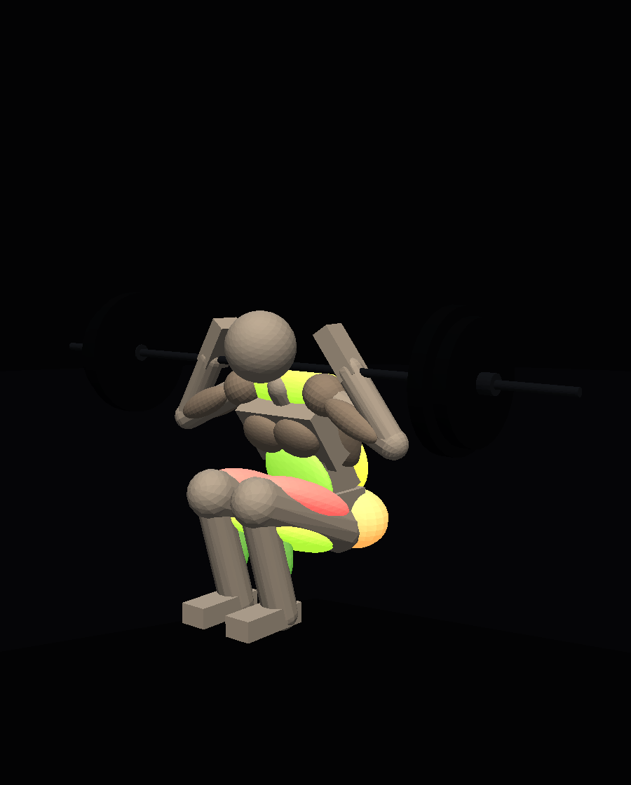
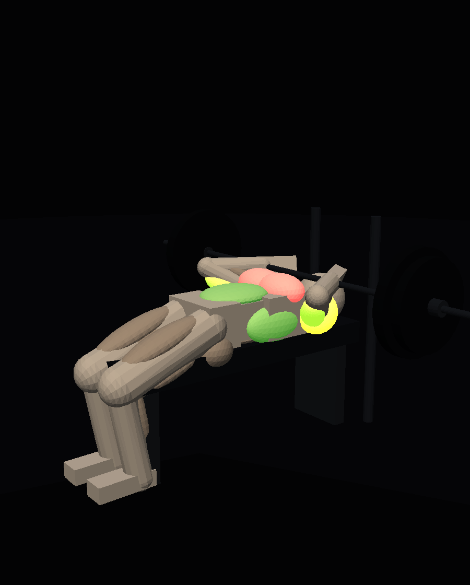
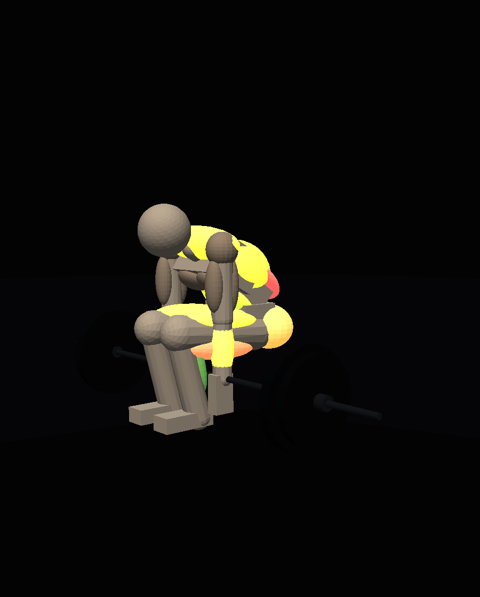
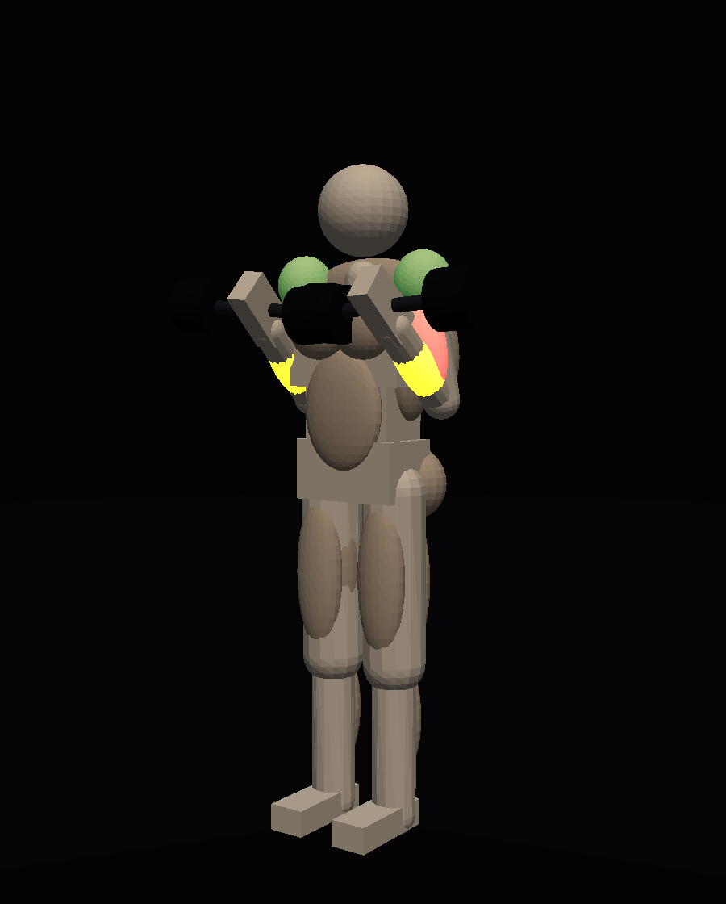

# Myo · 근육 모션 마네킹 렌더러

스타일라이즈드 사람 모형(마네킹)으로 **관절·근육 움직임을 섬세하게 표현·강조**하고, **바벨/덤벨 등 운동기구**와 함께 운동 동작을 렌더링하는 Three.js 기반 렌더러. 실사 사실성보다 **근육 부위 강조와 모션 가독성**에 초점.

> 스쿼트 · 벤치프레스 · 데드리프트(+덤벨 컬) 샘플 포함. EMG 문헌에 근거한 부위별 근육 활성화를 히트맵으로 시각화.

| 백 스쿼트 | 벤치프레스 | 데드리프트 | 덤벨 컬 |
| --- | --- | --- | --- |
|  |  |  |  |

<sub>위 이미지는 실제 3D 지오메트리(입체 캡슐·박스·타원체)를 카메라 투영 + z-buffer + 음영으로 렌더링한 결과(`npm run render`). 빛나는 부위가 활성화된 근육(히트맵). 브라우저 인터랙티브 렌더링은 `npm run dev`.

> 이 환경은 WebGL/브라우저가 없어 `npm run render`가 three.js 씬을 CPU 소프트웨어 래스터라이저로 렌더링한다. 실제 앱(`npm run dev`)은 동일한 씬을 WebGL로 렌더링한다. 가벼운 2D 도식 미리보기는 `npm run snapshot`(SVG, `docs/figures/*.svg`).</sub>

## 빠른 시작

```bash
npm install
npm run dev       # 데모(브라우저): 운동 선택 · 재생/스크럽 · 근육 활성도 범례
```

기타 스크립트:

```bash
npm run build     # 타입체크 + 프로덕션 번들
npm run render    # 헤드리스 3D 렌더(소프트웨어 래스터라이저) → docs/figures/render/*.png
npm run verify    # 헤드리스 자세 수치 검증(발 접지·바 위치·깊이 등)
npm run snapshot  # 2D 도식 미리보기 → docs/figures/*.svg
```

## 기능

- **절차적 마네킹** — 외부 에셋/라이선스 의존 없이 프리미티브로 조립한 14개 관절 골격.
- **근육 강조** — 14개 근육군을 뼈에 부착. 활성도(0..1)가 **히트맵 색 + 자발광 강도 + 수축 팽창**으로 표현. `Heatmap`/`Accent` 모드.
- **모션** — 키프레임 보간(`smoothstep`)과 핑퐁 루프로 1렙(하강↔상승)을 자연스럽게 반복. 재생/일시정지·속도·스크럽.
- **운동기구** — 바벨(바+플레이트), 덤벨, 평벤치. 매 프레임 손/몸에 동적 부착.
- **실시간 활성도 HUD** — 현재 부위별 근육 활성도를 막대로 표시.

## 동작 원리 (요약)

- Three.js `Object3D` 계층으로 **관절을 중첩** → 부모 회전이 자식에 전파(전방 운동학, FK).
- 운동은 `Keyframe`(관절 각도 + 근육 활성화 + 루트 위치/회전)으로 저작. `Animator`가 보간해 `MotionSample`을 만들고 `Mannequin.apply()`가 씬에 반영.
- 근육은 활성도에 따라 `emissive`(히트맵) 색·강도와 메시 스케일(수축)을 갱신.

자세한 내용:
- [리서치 · RESEARCH.md](docs/RESEARCH.md) — 기술 스택, 해부 리소스, 3대 운동 EMG 근거.
- [구현안 · IMPLEMENTATION.md](docs/IMPLEMENTATION.md) — 아키텍처, 데이터 모델, 검증 방법.

## 공개 API (라이브러리)

```ts
import { Stage, Mannequin, Animator, EXERCISES } from "./src";

const stage = new Stage(document.getElementById("stage")!);
const mannequin = new Mannequin();
stage.scene.add(mannequin.root);

const ex = EXERCISES[0];                       // 스쿼트
const inst = ex.setup(stage.scene, mannequin); // 기구 배치
const anim = new Animator(ex.keyframes, { duration: ex.duration, loop: ex.loop });

stage.applyCameraHint(inst.camera);
stage.setFrameCallback((dt) => {
  mannequin.apply(anim.update(dt)); // 포즈+근육 활성화 적용
  inst.update();                    // 기구를 신체에 부착
});
stage.start();
```

## 기술 스택

TypeScript · Three.js `0.184` · Vite. 의존성 최소(런타임은 `three`만).

## 한계 / 다음 단계

- 스타일라이즈드(프리미티브) 표현 — 사실적 근육 메시는 향후 Z-Anatomy(CC BY-SA) 등으로 교체 가능(설계상 분리).
- 근육 활성화 값은 EMG **근거 기반 근사치**(교육/시각화용).
- 동작은 저작된 FK 키프레임 — 실시간 IK/물리는 범위 외.
